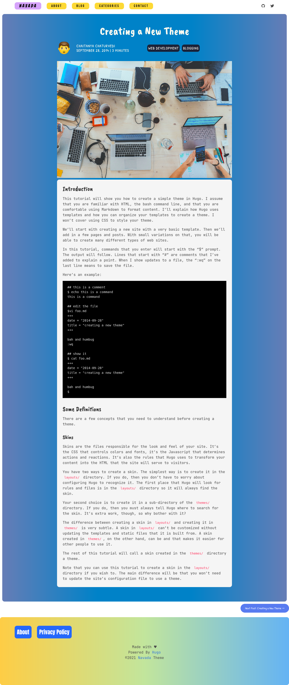
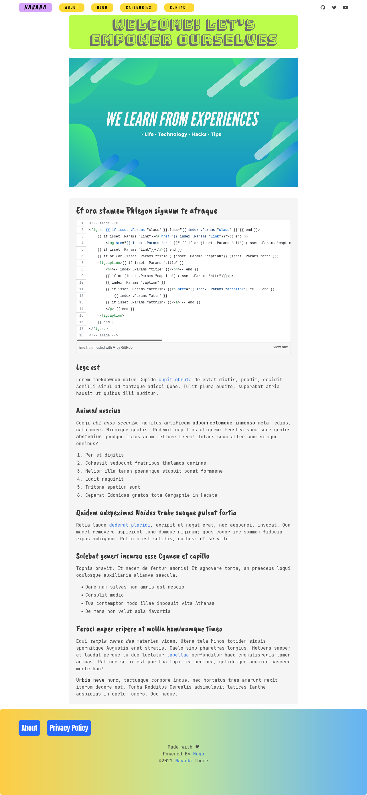

# Navada - Hugo theme
Navada is a fully responsive colorful-UI theme for Blogs.

## Demo
Check the [Demo](https://navada-hugo.netlify.app/) hosted on Netlify 👍





## Installation
In your Hugo website directory, go to themes folder by `$ cd themes` command. Then clone this repo with the `git clone` command.
```bash
$ cd themes
$ git clone https://github.com/chaitanya4vedi/navada.git
```
I have provided `config.toml` file in the `exampleSite` directory together with some sample posts inside `content` folder and images inside `static` folder.

You can simply copy paste `config.toml`, `content` and `static`in the root of your hugo site folder.

For more information read the official [setup guide](https://gohugo.io/overview/installing/) of Hugo.+

## Writing Posts
Create a new `.md` file in the *content/blog/2021/* folder
or you can simply type this command with the post title in it
`hugo new blog/2021/post-title.md`
```yml
---
title: Creating a New Theme
author: "Cahitanya Chaturvedi"
tags: ["Theme", "Hugo"]
date: 2014-09-28
images:
  - /images/Group-Working.jpg
categories:
  - Web development
  - Blogging
---
```

## Credits
Thanks to [Janne Kemppainen](https://twitter.com/pakstech) for the wonderful posts on hugo themes.

----

If you liked my work please consider supporting me on [BuyMeACoffee](https://www.buymeacoffee.com/chaitanya4vedi)

<a href="https://www.buymeacoffee.com/chaitanya4vedi"></a>
