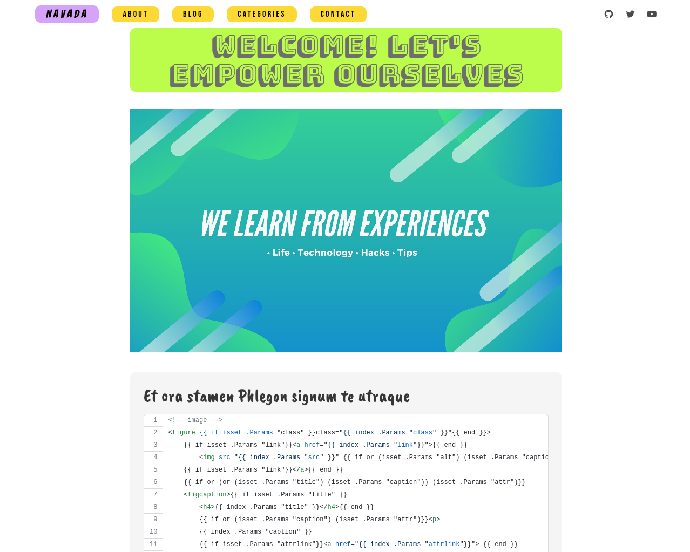
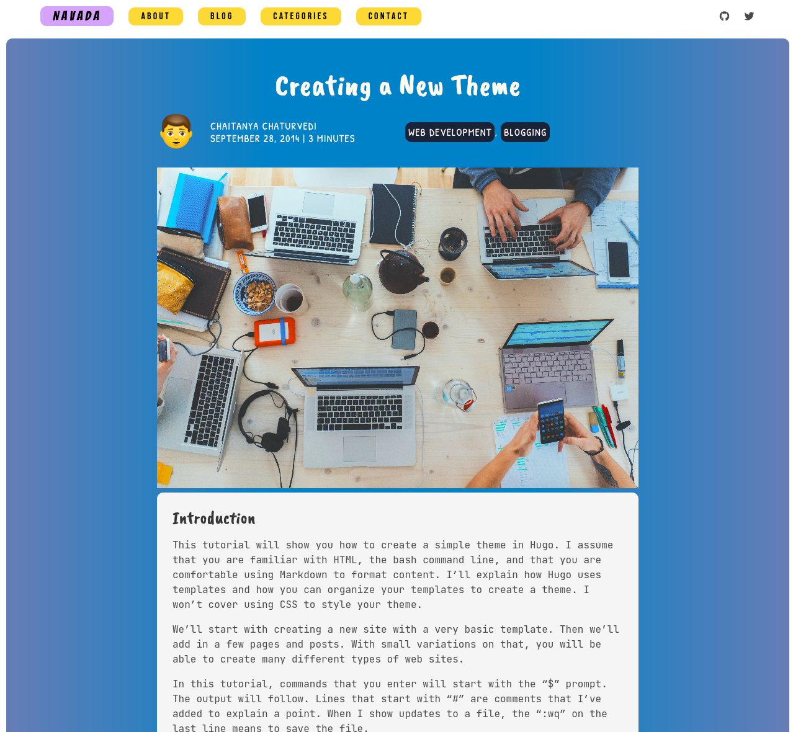
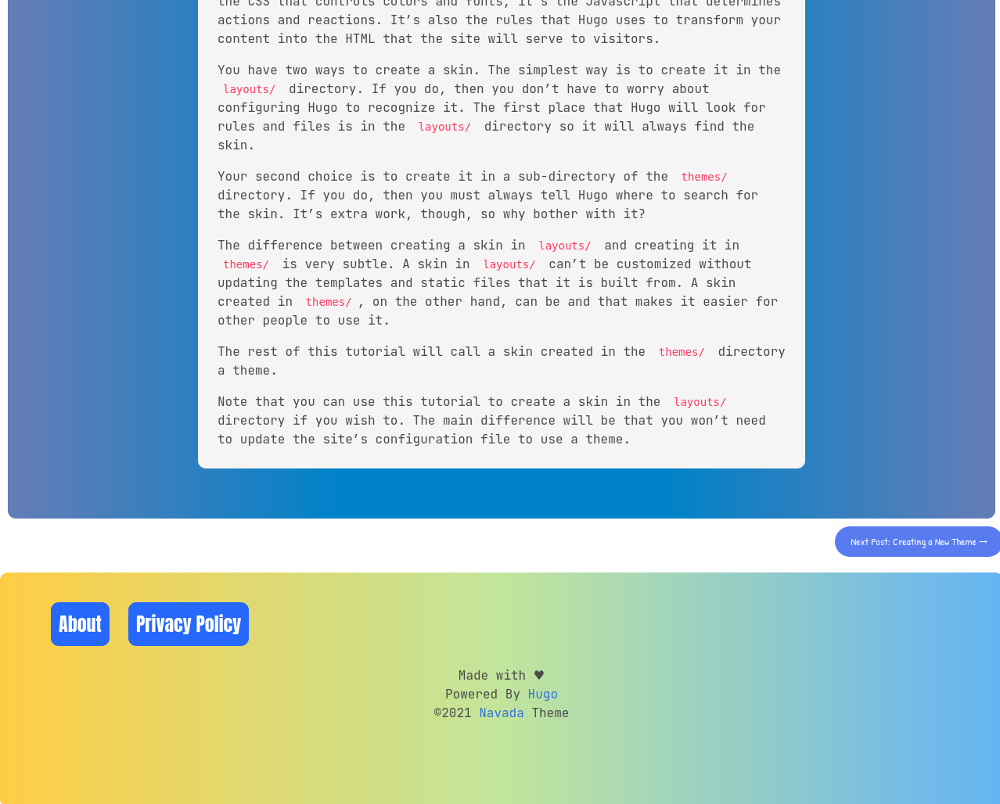

# Navada - Hugo theme
Navada is a fully responsive, colorful and attractive UI theme for Blogs and similar content.

## Screenshots


## Index page

## Blog page

## Footer


## Installation
In your Hugo website directory, go to themes folder by `$ cd themes` command. Then clone this repo with the `git clone` command.
```bash
$ cd themes
$ git clone https://github.com/chaitanya4vedi/navada.git
```
I have provided `config.toml` file inside the `exampleSite` directory together with some sample posts inside `content` folder and images inside `images` folder. Copy and replace the `config.toml` and `content` folder to the root directory and copy paste `images` folder to the `static` folder of the root directory.

For more information read the official [setup guide](https://gohugo.io/overview/installing/) of Hugo.+

## Writing Posts
Create a new `.md` file in the *content/blog/2021/* folder
or you can simply type this command with your post's title in it
`hugo new blog/2021/post-title.md`
 or you can also type `hugo new post-title.md` hugo will automatically create posts inside `content/blog` folder.

## Configs

### Author Name and Image
In the `config.toml` file that you copy pasted from exampleSite to root directory, change the the author name and image to show up on each post.
```
[params]
    author = "Janne Kemppainen"
    authorImage = "/images/janne.jpg"
```
### Default Archetype
This is the default archetype.
```
---
title: ""
date:
description: ""
draft: true
author: ""
tags: ""
images: 
-
categories: 
-
---
```
### Images
Navada is a fully responsive, colorful and attractive UI theme for Blogs and similar contentThere are two ways to create a list in YAML so you can use either one of these options:

#### Option 1
```
images:
  - /images/blog/03/fields.jpg
```
Note that indentation matters here.

#### Option 2
```
images: ["/images/blog/03/fields.jpg"]
```
# Open to Suggestions and Improvements
I have lots of stuff in my mind to add to this theme. Some of the features i would like to include are -
- Comments
- Multi Author Support
- Cache busting for CSS

If you think i have missded something or you have an idea or suggestion that you wanna add, feel free to raise an issue. I am open to improvements for this theme. I would be more than glad to hear from you or take your help. Thank you!

## Credits
Thanks to [Janne Kemppainen](https://twitter.com/pakstech) for the wonderful posts on hugo themes.

----

If you liked my work please consider supporting me on [BuyMeACoffee](https://www.buymeacoffee.com/chaitanya4vedi)

<a href="https://www.buymeacoffee.com/chaitanya4vedi"></a>
